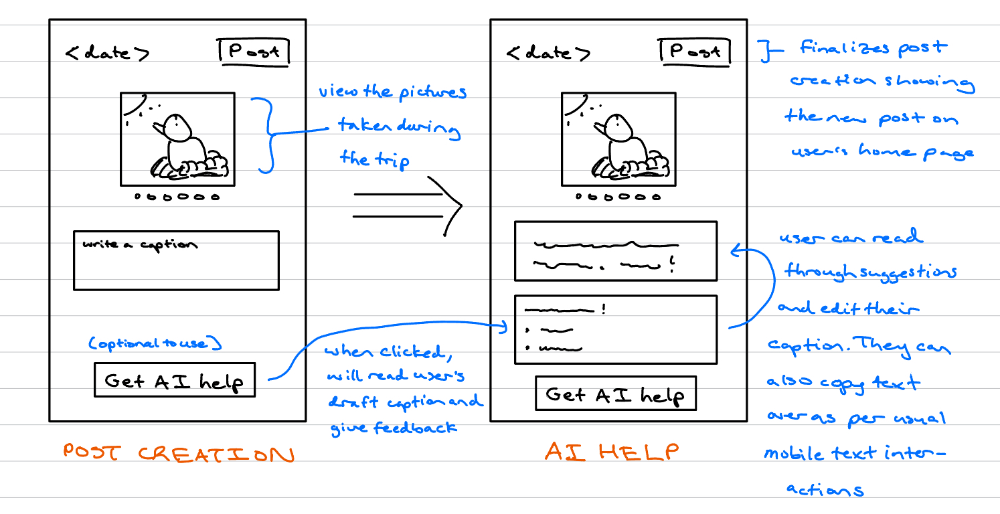

# Hatch
A simple day planner. This implementation focuses on the core concept of organizing activities for a single day with both manual and AI-assisted scheduling.

## Concept: Posting

Please see [posting.spec](posting.spec) for the original and AI-augmented specification.

## UI Sketches + User Journey



Jamie has recently finished his birding session and is working on turning it into a post. On the post creation view, Jamie is able to view his trip photos displayed in a carousel view to serve as reference for caption-writing. Jamie begins typing a caption: "Saw some birds today, pretty cool". Upon reading through it believes his wording is not fluid and engaging enough. Seeking help, Jamie taps on the "Get AI Help" button beneath the caption box, which provides 3 alternative caption suggestions that focus on fluidity/grammar/phrasing/tone. 

Jamie sifts through these suggestions and likes "Had a relaxing birdwatching session today — caught sight of some beautiful birds!" However, believing that it could benefit from more detail, he edits some more and settles for: "Enjoyed a peaceful morning at the wetlands spotting a Great Blue Heron!" With an improved caption in place, Jamie feels more confident that his post will encourage comments and interaction from friends. Feeling content, they go ahead and post their images and caption for others to see. Later, Jamie’s friends view the post and one comments: "Mornings are the best time to go birding! I love all the bird calls you get to hear." Jamie replies, "Agreed! I plan to go morning birding at a nearby open field next." Thanks to AI-assisted captioning, Jamie’s post provides clear context that encourages richer discussion among friends.

## How to Run the Application

**Run all test cases:**
```bash
npm start
```

**Run specific test cases:**
```bash
npm run manual    # Manual caption writing only
npm run llm       # LLM-assisted caption writing only
npm run mixed     # Mixed manual + LLM caption writing
```

## Rich Testing

These experiments have been retained in birdposting-tests.ts.

**Run specific experiments:**
```bash
npm run vague     # LLM-assisted caption writing based on a very vague caption
npm run casual    # LLM-assisted caption writing based on a caption of very casual/conversational tone
npm run sad       # LLM-assisted caption writing based on a sadder caption
```

### LLM Augmentation on Vague Captions

Since this AI augmentation is limited to text input for cost reasons (reading the images of the post would be rather expensive), there could be a risk that AI would start making up details in an attempt to make a better caption. This may especially be the case if the original draft caption does not give much to build off of, which inspired this test case.

To be honest, I did not expect there to be any bug reveals with this as my prompt includes a condition for AI to not fabricate any facts not listed already in the original caption. Indeed, this is the case. Rather, I just experimented with a worse prompt by removing the following:

"
- Do not add fictional details.
- Preserve factual content from the user's draft (do not invent new facts)
"

Surprisingly, AI still did not contrive any new information and generated captions all the same (although of course they were also pretty generic). So, no real errors here.

### LLM Augmentation on Multilingual Captions

This was inspired by the fact that casual, natural mannerisms are more difficult for AI to imitate, hence why AI text can often be detected. Indeed, my prompt in birdposting.ts has this issue. With this in mind, I decided to add an extra condition to the prompt: "Preserve the tone of the original caption."

Input: lol the bird kept trying to steal my fries
Output: Haha, this little guy had a hankering for my fries! Has any bird ever tried to snag your snacks?

Even with the extra condition, AI was unable to accurately imitate the tone of the original caption. It was able to detect the original's lightheartedness, but its verbal expressions are much more formal and put together.

### LLM Augmentation on Sad Captions

It would be good to test that AI can handle different emotionally charged captions. Indeed, if I give a sad caption and use my prompt in birdposting.ts, AI will generally twist the caption to be happier. I tried adding an extra condition telling AI to:

- Maintain the mood (happy, sad, etc.) of the original caption

Input: Didn't get to see too many birds because of the cloudy weather today...
Output: 

{
  "suggestions": [
    "Even with cloudy skies today, the birdwatching was a little quiet. Did anyone else have a slow day outdoors? ☁️🐦",
    "Today's gloomy weather kept the bird sightings low, but the hunt continues! What's your go-to birding spot when the weather isn't cooperating?",
    "A bit of a bird drought today thanks to the clouds! 🌧️ Anyone else find their birding adventures impacted by the weather? Share your stories!"
  ]
}

The first suggestion is the closest to the original tone of the caption, but the others do not -- in an attempt to make the content more engaging (call to action, asking a question), AI still adds an emotional switch towards happy/curious to the caption, which may not be the user's intent.

## Validators

A few things worth checking is if AI adheres to the conditions set in the prompt properly. These include:

1) the number of alternative captions provided
2) not contriving any information not in the original caption
3) providing suggestions that are indeed at most 2 sentences long (to meet the conciseness point)

The validation of all of these is handled by the validateSuggestions helper function that parseAndApplySuggestions will call on. #2 above is split into two parts: numbers and proper nouns.

(Interestingly, AI fails quite often on #3!)


