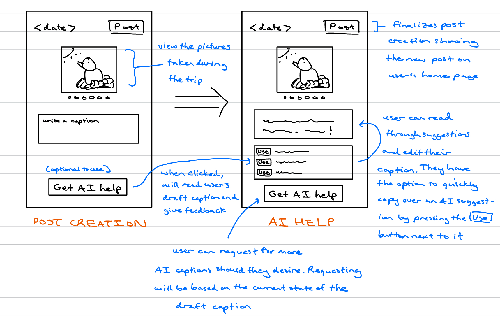

# Hatch

An app for birders to share their sightings with others in a simple and personable way. This implementation focuses on the concept of making posts, in particular writing the caption for the post, for which we will add an AI augmentation.

## Concept: Posting

Please see [birdposting.spec](birdposting.spec) for the original and AI-augmented specification.

## UI Sketches + User Journey



Jamie has recently finished his birding session and is creating a post. On the post creation screen, his photos appear in a carousel to guide caption writing. He starts with: *"Saw some birds today, pretty cool,"* but feels that it lacks clarity and engagement. Seeking help, Jamie taps on the "Get AI Help" button to receive 3 alternative caption suggestions that improve grammar, phrasing, and tone. He selects one -- *"Had a relaxing birdwatching session today — caught sight of some beautiful birds!"* -- then edits some more into: *"Enjoyed a peaceful morning at the wetlands spotting a Great Blue Heron!"* With AI assistance, Jamie moves from a vague draft to a polished caption that better reflects his experience and invites richer engagement from his friends.

## How to Run the Application

**Run all test cases:**
```bash
npm start
```

**Run specific test cases:**
```bash
npm run manual    # Manual caption writing only
npm run llm       # LLM-assisted caption writing only
npm run mixed     # Mixed manual + LLM caption writing
```

## Rich Testing

These experiments have been retained in birdposting-tests.ts.

**Run specific experiments:**
```bash
npm run vague     # LLM-assisted caption writing based on a very vague caption
npm run casual    # LLM-assisted caption writing based on a caption of very casual/conversational tone
npm run sad       # LLM-assisted caption writing based on a sadder caption
```

### LLM Augmentation on Vague Captions

Since this AI augmentation is limited to text input for cost reasons (reading the images of the post would be rather expensive), there could be a risk that AI would start making up details in an attempt to make a better caption. This may especially be the case if the original draft caption does not give much to build off of, which inspired this test case.

To be honest, I did not expect there to be any bug reveals with this as my prompt includes a condition for AI to not fabricate any facts not listed already in the original caption. Indeed, this is the case. Rather, I just experimented with a worse prompt by removing the following:

```
- Do not add fictional details.
- Preserve factual content from the user's draft (do not invent new facts)
```

Surprisingly, AI still did not contrive any new information and generated captions all the same (although of course they were pretty generic like the original). So, there was nothing wrong nor remaining issues.

### LLM Augmentation on Casual Captions

This was inspired by the fact that casual, natural mannerisms are more difficult for AI to imitate, hence why AI text can often be detected. Indeed, my prompt in birdposting.ts has this issue. With this in mind, I decided to add an extra condition to the prompt to see if it would help: "Preserve the tone of the original caption."

* Input: lol the bird kept trying to steal my fries
* Output: Haha, this little guy had a hankering for my fries! Has any bird ever tried to snag your snacks?

Even with the extra condition, AI was unable to accurately imitate the tone of the original caption. It was able to detect the original's lightheartedness, but its verbal expressions are much more formal and put together. Hence, no improvement, and tone preservation remains an issue.

### LLM Augmentation on Sad Captions

It would be good to test that AI can handle different emotionally charged captions. Indeed, if I give a sad caption and use my prompt in birdposting.ts, AI will generally twist the caption to be happier. I tried adding an extra condition telling AI to:

"Maintain the mood (happy, sad, etc.) of the original caption"

* Input: Didn't get to see too many birds because of the cloudy weather today...
* Output: 

```
{
  "suggestions": [
    "Even with cloudy skies today, the birdwatching was a little quiet. Did anyone else have a slow day outdoors? ☁️🐦",
    "Today's gloomy weather kept the bird sightings low, but the hunt continues! What's your go-to birding spot when the weather isn't cooperating?",
    "A bit of a bird drought today thanks to the clouds! 🌧️ Anyone else find their birding adventures impacted by the weather? Share your stories!"
  ]
}
```

In an attempt to make the content more engaging (call to action, asking a question), AI still adds an emotional switch towards happy/curious to the caption, which may not be the user's intent. Hence, no improvements here.

## Validators

A few things worth checking is if AI adheres to the conditions set in the prompt properly. These include:

1) the given suggestions are unique
2) the number of alternative captions provided is 3
3) not contriving any information not in the original caption
4) providing suggestions that are indeed at most 2 sentences long (to meet the conciseness point)

The validation of these are handled by lines 97-101 (in parseAndApplySuggestions) and the validateSuggestions helper function that parseAndApplySuggestions will call on. #2 above is split into two parts: numbers and proper nouns.

(Interestingly, AI fails quite often on #4!)


